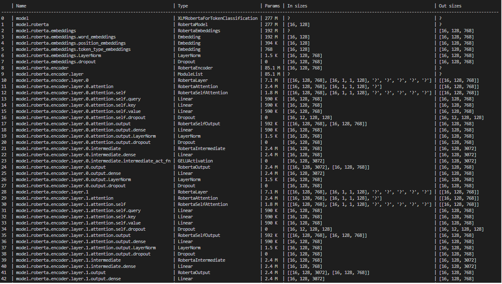

- Build Module Model

- Build Module Dataloader

- Callback
    + Save checkpoint
    + Early stoping
    + Model Sumarize

- Logger
    + mlflow save model artifacts and hypeparameter
    + tensorboard 
    + wandb

- Debug:
    + Use 10% training dataset and 16.6% val dataset
    + Use 8 batches of train and 2 batches of val
    + Show input size and output size for each layer


- Understanding your model:
    + Find bottlenecks in your code
    + Logging and Tracking

- Optimization model
    + Simple implement
        ```
            model = ModuleModel()
            model.eval()
            dropout = nn.Dropout()
            dropout.train()
            dropout(model(x))
        ```
    + Drop layers
        ``` 
            model_weights = checkpoint["state_dict"]
            for key in list(model_weights):
                model_weights[key.replace("auto_encoder.", "")] = model_weights.pop(key)
            model.load_state_dict(model_weights)
            model.eval()
            model(x)

        ```
- Traning with mutiple GPU/TPU
    ```
        # DEFAULT (int) specifies how many GPUs to use per node
        Trainer(accelerator="gpu", devices=k)

        # Above is equivalent to
        Trainer(accelerator="gpu", devices=list(range(k)))

        # Specify which GPUs to use (don't use when running on cluster)
        Trainer(accelerator="gpu", devices=[0, 1])

        # Equivalent using a string
        Trainer(accelerator="gpu", devices="0, 1")

        # To use all available GPUs put -1 or '-1'
        # equivalent to list(range(torch.cuda.device_count()))
        Trainer(accelerator="gpu", devices=-1) 
    ```

- Modularize your projects
    + Build DataModule
    ```
    class DataModule(pl.LighningDataModule):
        def __init__(self, ...):
            ....

        def prepare_data(self):
            #dowload, tokenizer,...
        
        def setup(self, stage: str):
            # split, transform,
            self.train_data
            self.test_data
            self.val_data
            # fit, test, predict
            ...

        def train_dataloader(self):
            # Make trainloader
            return Dataloader(self.train_data, ... )

        def val_dataloader(self):
            # Make val_dataloader
            return Dataloader(self.val_data, ... )

        def test_dataloader(self):
            # Make testloader
            return Dataloader(self.test_data, ... )
    ```
    + Build DataModule
    + Custom Optimizer
    ```
    import torch
    from pytorch_lightning.utilities import cli as pl_cli
    from pytorch_lightning import demos


    class LitAdam(torch.optim.Adam):
        def step(self, closure):
            print("⚡", "using LitAdam", "⚡")
            super().step(closure)


    class FancyAdam(torch.optim.Adam):
        def step(self, closure):
            print("⚡", "using FancyAdam", "⚡")
            super().step(closure)


    cli = pl_cli.LightningCLI(DemoModel, BoringDataModule)
    ```
    + Custom Schedulers
    ```
    import torch
    from pytorch_lightning.utilities import cli as pl_cli
    from pytorch_lightning import demos


    class LitLRScheduler(torch.optim.lr_scheduler.CosineAnnealingLR):
        def step(self):
            print("⚡", "using LitLRScheduler", "⚡")
            super().step()


    cli = pl_cli.LightningCLI(DemoModel, BoringDataModule)
    ```
- 


